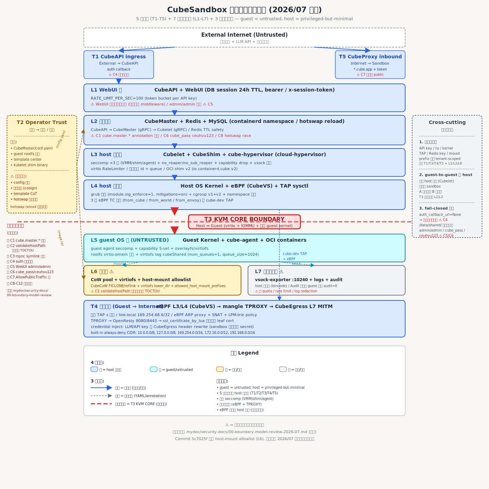

# CubeSandbox 安全边界系列文档

> 系列定位: 与 [`系统安全边界总览.svg`](../系统安全边界总览.svg) 配套的**按真边界**深入展开。SVG 给出一图速览,本系列逐边界讲清楚"这条边界由哪些层的哪些机制共同保护"。
>
> 与 [`CubeSandbox安全机制清单.md`](../CubeSandbox安全机制清单.md) 的关系: 清单.md 按"机制主题"组织(虚拟化/内核/运行时/API/部署),便于查"机制 X 是什么";本系列按"安全边界"组织(T1-T5),便于查"边界 Y 上有哪些机制"。两份文档互为索引,事实一致。

---

## 阅读路径

- **顺序阅读**: T1 → T2 → T3 → T4 → T5(与 SVG 自上而下、自左向右的顺序一致)
- **主题跳读**:
  - 想了解 **guest = untrusted 模型如何落地** → 重点读 [T3](T3-kvm-core-boundary.md)
  - 想了解 **网络隔离双保险 (eBPF + TPROXY)** → 重点读 [T4](T4-egress.md) 与 [T5](T5-cubeproxy-inbound.md)
  - 想了解 **API 接入层** → 重点读 [T1](T1-cubeapi-ingress.md)
  - 想了解 **运维侧的可信根** → 重点读 [T2](T2-operator-trust.md)

---

## 5 个真边界 (T1-T5)

| 边界 | 名称 | 一句话 | 文档 |
|------|------|--------|------|
| **T1** | CubeAPI ingress | 外部互联网 (公网用户 / LLM API / 第三方服务) → CubeAPI 的访问入口 | [T1-cubeapi-ingress.md](T1-cubeapi-ingress.md) |
| **T2** | Operator Trust | 运维人员 → CubeMaster/conf.yaml / guest rootfs / template center / kubelet shim binary 的可信根 | [T2-operator-trust.md](T2-operator-trust.md) |
| **T3** | KVM CORE BOUNDARY ★核心 | 宿主进程 (Cubelet/CubeShim/cube-hypervisor) ↔ Guest OS kernel + cube-agent 的硬件级隔离面 | [T3-kvm-core-boundary.md](T3-kvm-core-boundary.md) |
| **T4** | Egress (Guest → Internet) | Guest 内 sandbox 通过 host 网络出到互联网 (LLM API / 第三方服务 / 模型下载) 的强制审计面 | [T4-egress.md](T4-egress.md) |
| **T5** | CubeProxy inbound (Internet → Sandbox) | 公网用户 → `*.cube.app` 通配 DNS → CubeProxy → Sandbox 暴露端口 的入站面 | [T5-cubeproxy-inbound.md](T5-cubeproxy-inbound.md) |

---

## 每篇文档的统一结构

| 节 | 内容 |
|----|------|
| **1. 边界概述** | 数据流向图 (ASCII)、SVG 位置坐标、信任跃迁语义 |
| **2. 涉及的纵深防御层** | L1-L7 中哪些参与本边界、参与的具体作用 (✅/❌ 标记) |
| **3. 机制清单** | 按 L 层分组,每条机制含 文件位置 / 作用 / 配置/启用 / 与本边界的关联 |
| **4. 关键交互** | 与相邻边界的关系、数据流上下游 |
| **5. 设计权衡** | 为什么把这条机制放在这一层、这一边界 (与 SVG 设计理念对应) |

---

## 设计理念 (从 SVG 图例继承,贯穿 5 篇文档)

- **guest = untrusted, host = privileged-but-minimal** —— 本系列反复出现的根本张力
- **5 真边界全在 host 信任域** (T1/T2/T3/T4/T5) —— 不在 guest 内做任何访问控制决策
- **三层 seccomp (VMM / shim / agent)** —— 纵深防御的核心
- **网络双保险 (eBPF + TPROXY)** —— L3/L4 内核态 + L7 透明代理
- **eBPF 必须放 host 内核** —— 策略执行点必须在不可信域外

---

## 7 个纵深防御层 (L1-L7) 在 5 边界中的分布

| 层 \ 边界 | T1 | T2 | T3 | T4 | T5 |
|-----------|----|----|----|----|-----|
| **L1** WebUI 域 | ✅ | ❌ | ❌ | ❌ | ❌ |
| **L2** 控制面域 | ✅ | ✅ | ❌ | ❌ | ✅ |
| **L3** host 进程域 | ✅ | ✅ | ✅★ | ✅ | ✅ |
| **L4** host 内核域 | ✅ | ❌ | ✅★ | ✅★ | ✅ |
| **L5** guest OS 域 | ❌ | ❌ | ✅★ | ✅ | ❌ |
| **L6** 存储域 | ❌ | ✅ | ✅ | ✅ | ✅ |
| **L7** 可观测性域 | ✅ | ✅ | ✅ | ✅ | ✅ |

(✅ = 参与本边界,❌ = 不直接参与;★ = 本边界上的核心层)

---

## 不在本系列范围

- **横切关注点 (3 个)**: 多租户隔离 / guest-to-guest 经 host / fail-closed 默认 —— 详见 SVG 右侧 Cross-cutting 面板与清单.md
- **已知实现缺陷 (C1-C12)**: 不在本系列文档中重复列出,见 SVG 左下"已知实现缺陷"面板
- **机制细节深挖**: 详见清单.md §1-§5,本系列只点出机制属于哪个边界、文件位置,不再重复机制定义

---

## 维护约定

- 新增安全机制时: 先在 SVG 上找到所属 T 边界,再在本系列对应文档的"机制清单"节添加条目,最后回头在清单.md 主题章节添加完整定义
- 修改机制实现时: 优先更新清单.md 主题章节 (那里有源码引用),再反向同步本系列的"文件位置"字段
- 跨边界共有机制 (如 L7 vsock-exporter 同时服务 T3 与 T4): 在每个相关边界文档中**完整列出**,不互相"详见 T3"省略

---

> 本系列文档反映 **2026/07 修订** 后的安全边界模型;最后一次同步: 2026/07/06。